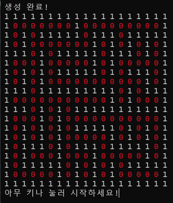
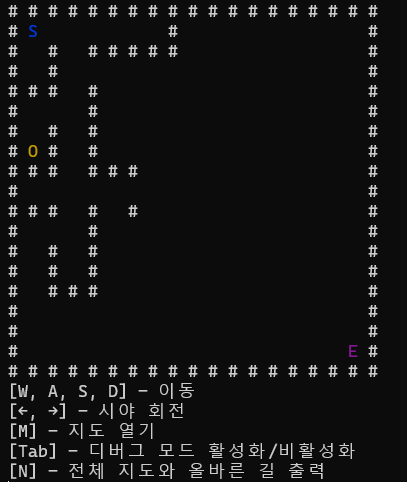

# Ray-Casting-Maze
A simple 2.5D maze renderer implemented with ray casting.

    
    

  

  

  

# 개요
 

터미널에서 3D 공간을 표현할 수 있을지 궁금해서 작성을 시작한 코드입니다. 
실제 3차원 공간을 저장하는 것보단, 일단 2차원 공간을 3차원으로 표현하는 것이 좋겠다는 생각이 들었고, 
여러가지 생각해 본 결과 미로와 레이캐스팅을 선택해 구현하게 되었습니다. 
    

# 주요 기능
 

[게임 설정 관련]
- 화면의 가로 및 세로 크기, 미로의 가로 및 세로 크기 설정 
- 플레이어의 시야각 감도, 플레이어의 시야 회전 감도 설정 
 

[미로 관련]
- 랜덤한 미로 생성 
- 전체 지도 확인 
- 최단 경로 시각화 
 

[레이캐스팅 관련]
- 1인칭 시점 미로를 아스키를 통한 출력 
- 플레이어 좌표 이동 및 그에 맞는 화면 출력 
    

# 3D (사실상 2.5D) 구현 과정
 

레이캐스팅은 2D로 구현된 공간을 3D처럼 보이게 렌더링 시키는 기술입니다. 

플레이어의 시야각 범위와, 현재 위치를 고려하여 화면 가로 픽셀 수 만큼의 광선(ray)를 발사합니다. 
광선은 벽에 닿거나, 최대 시야 범위에 도달할 때 까지 광선을 전진시킵니다. 
만약 벽에 닿았다면 그 거리를 저장해둡니다. 

벽까지의 거리에 따라 화면을 구성합니다. 
벽이 가깝다면 더 밝고 밀도가 높은 문자를 사용해 세로로 긴 선을 그립니다. 
벽이 멀다면 더 어둡고 밀도가 낮은 문자를 사용해 세로로 짧은 선을 그립니다.  
이를 이용해 가까운 벽과 먼 벽을 시각화 할 수 있습니다. 
    

# 개선점
 

각도가 0, 90, 180, 270인 경우에는 삼각함수 값이 불안정해집니다. 
따라서 이 코드는 절대로 사용자가 위에서 언급한 각도인 상태에서의 화면을 출력하지 않고, 만약 해당 각도인 경우 조금의 보정을 가합니다. 
이는 사용자가 위에 해당하는 각도의 화면을 볼 수 없다는 단점이 있습니다.  
또한, 원래의 레이캐스팅은 DDA라는 격자만을 검사하는 알고리즘을 사용해 최적화를 하지만, 이 코드에서는 광선을 일정한 조그만한 단위씩 전진시키면서 벽과 닿았는지 검사합니다. 
이 코드상 엄청나게 큰 설정값을 지정하지 않는 이상 문제 없이 돌아간다고 판단하여 굳이 사용하지 않았지만, 만약 최적화가 필요한 상황이라면 DDA 알고리즘을 적용시키는 것이 좋아 보입니다.  
또한, windows 헤더 기반의 함수들을 사용하기 때문에 리눅스에서는 실행이 
